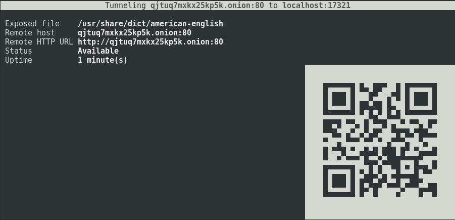
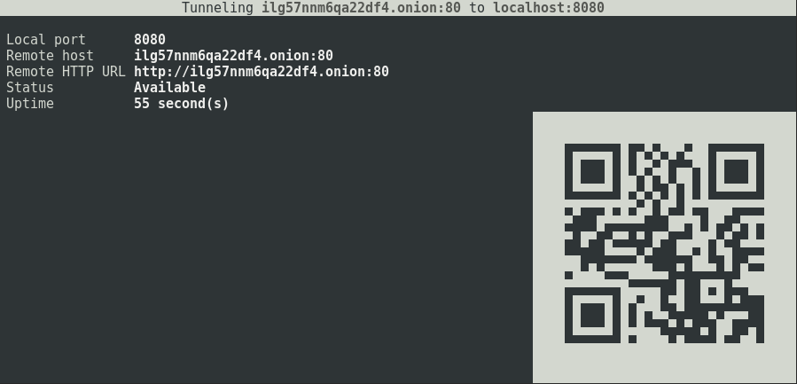

# Introducing `onion-expose`

`onion-expose` is a utility that allows one to easily create and control temporary Tor onion services.

`onion-expose` can be used for any sort of TCP traffic, from simple HTTP to Internet radio to Minecraft to SSH servers.
It can also be used to expose individual files and allow you to request them from another computer.

# Why not just use `ngrok`?

`ngrok` is nice. But it requires everything to go through a central authority (a potential security issue), and imposes
artificial restrictions, such as a limit of one TCP tunnel per user. It also doesn't allow you to expose files easily
(you have to set it up yourself).

# Screenshots




# Getting started

For now, there's no setup.py script (working on it...)

```
    $ pip install -r requirements.txt
    $ cd onionexpose
    $ python main.py 8080
```

This will create a Tor onion service tunneling port 80 of the onion service to port 8080 locally.

```
    $ python main.py /usr/share/dict/words
```

This will create a Tor onion service tunneling port 80 of the onion service to a simple HTTP server responding with
the content of `/usr/share/dict/words` on a request to the root.

```
    $ python main.py 8080 --remote-port 8080
```

This tunnels port 8080 of the onion service to port 8080 locally. Note that this also works for the file server.

If you want to be able to connect to an onion service, but your application doesn't support SOCKS5 proxying, you can
use netcat to tunnel a port on localhost to that onion service:

```
    $ ncat -c "ncat --proxy-type socks5 --proxy 127.0.0.1:9050 <addr>.onion <remote-port>" -l 1234
```

# Security properties

In theory, `onion-expose` tunnels _should_ have the same security properties as regular Tor onion services. Note that
this explicitly _doesn't include confidentiality of files that are exposed via the file server_. If you need confidentiality
for the files you're exposing, use `openssl enc` to encrypt it before you expose it.

However, do note that `onion-expose` comes with absolutely no warranty.

# Compatibility

`onion-expose` supports _only Python 3_. It will not run on Python 2. It has been tested on Debian 8 "Jessie" with
Python 3.4 and Tor 0.2.7.6. It _should_ run on Windows, OS X, or (Open|Free)BSD, but I haven't tested it.
